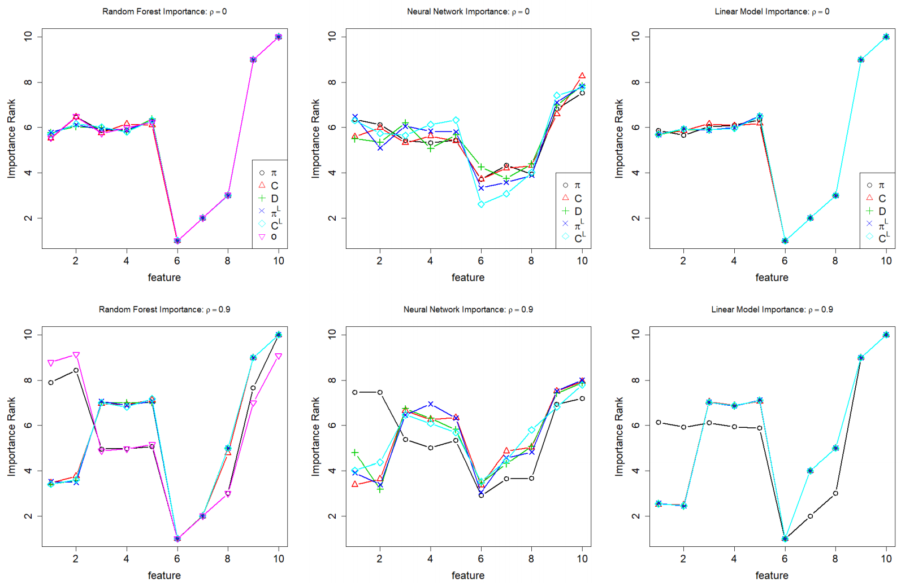

### Please Stop Permuting Features: An Explanation and Alternatives
#### Giles Hooker and Lucas Mentch, 2019

> When features in the training set exhibit statistical dependence, permutation methods can be highly misleading when applied to the original model.

$\require{boldsymbol}$

### Feature importance

Given a model $f : \mathcal X \rightarrow \mathcal Y$ where $\mathcal X$ is made up of multiple features,
quantify, for each feature $j$, its contribution to the prediction.

### Variable Importance

Breiman (2001)

* $X$ - feature matrix
* $X^{\pi, j}$ - feature matrix with $j$-th feature (column) permuted
* $\boldsymbol x_i$ - $i$-th instance (row)

$$VI_j^\pi =
    \sum_{i=1}^N
    {\color{Lavender}
    \underbrace{
        L(y_i, f(\boldsymbol x_i^{\pi,j}))
    }_\text{Loss on permuted data}}
    - {\color{Skyblue}
    \underbrace{
        L(y_i, f(\boldsymbol x_i))
    }_\text{Loss on original data}}$$

### Partial Dependence Plots

Friedman (2001)

* $X^{x,j}$ - feature matrix with $j$-th feature set to $x$ for all instances

$$PD_j(x) = \frac{1}{N} \sum_{i=1}^N f(\boldsymbol x_i^{x,j})$$

### Individual Conditional Expectation

Goldstein et al. (2015)

$$ICE_{i,j}(x) = f(\boldsymbol x_i^{x,j})$$

### Theorem 1.

For $f(x) = \hat \beta_0 + \sum_{j=1}^p \hat \beta_j x_j$ fit by least squares

1. $E_\pi VI_j^\pi = 2\hat \beta^2_j \sum_{i=1}^n (x_{ij} - \bar x_j)^2$
2. $PD_j(x) = C_j + \hat \beta_j x$ where $C_j = \sum_{j' \neq j} \hat \beta_{j'} x_{ij'}$
3. $ICE_{i,j}(x) = C_{i,j} + \hat \beta_j x$ where $C_{i,j} = \sum_{j' \neq j} \hat \beta_{j'} x_{ij'}$

### Ground truth model

$$\begin{array}{r}
    y_i = x_{i1} + x_{i2} + x_{i3} + x_{i4} + x_{i5} + 0 x_{i6} \\
    + 0.8 x_{i8} + 1.2 x_{i9} + 1.5 x_{i10} + \epsilon_i
    \end{array}$$

Expected feature importance ranking:

$$10 \succ 9 \succ 1 = 2 = 3 = 4 = 5 \succ 8 \succ 7 \succ 6$$

### Ground truth model

$$\begin{array}{r}
    y_i = x_{i1} + x_{i2} + x_{i3} + x_{i4} + x_{i5} + 0 x_{i6} \\
    + 0.8 x_{i8} + 1.2 x_{i9} + 1.5 x_{i10} + \epsilon_i
    \end{array}$$

* $\epsilon_i \sim N(0, 0.1^2)$
* $x_{ij} \sim \textrm{Uniform}[0,1]$
* $x_{i1}, x_{i2}$ correlated by a Gaussian copula

### Gaussian copula

### Simulation results: Variable Importance

---

Features 1 and 2 are correctly ranked when they are uncorrelated,
but are ranked higher by nonlinear models when correlated.

Feature importances are a tool for examining $f(\boldsymbol x)$;
here we see them depend on the feature distribution.

### Simulation results: Partial Dependence Plots

### Simulation results: Individual Conditional Expectation Plots

---

The dependence of $f(\boldsymbol x)$ on $x_1$ is well-behaved near the source data distribution, and fluctuates outside it.

### A simpler example

$$y = x_1 + 0 x_2 + \epsilon$$

* $\epsilon \sim N(0, 0.05)$
* $x_1, x_2$ linked by Gaussian copula with correlation 0.9

### RF learned:

### RF ICE+PDP

### NN learned:

### NN ICE+PDP

### Lessons

* Dependence between input features concentrates data in a subset of the space spanned by permuted datasets
* Variable importance computed by a permutate-and-predict strategy depends on evaluating $f(\boldsymbol x)$ out-of-distribution
* Out-of distribution predictions of complex models may be unpredictable

### Variable importance alternatives

* Permute/perturb conditionally (keeping the generated samples in-distribution)
* Remove and relearn
* Permute and relearn
* Condition and relearn

---

### Exploiting out-of-distribution predictions

---

### Setting

* __An adversary__ wants to deploy a (colloquially) biased classifier $f$ for making critical decisions (e.g. parole, bail, credit)

* The adversary will provide their classifier as a black box

* Customers and regulators will use explanation methods (e.g. LIME and SHAP) to determine if the black box is suitable to be deployed (check that it is not biased)

---

The adversary can succeed by constructing a classifier $e$ that predicts like $f$ (is biased) on real data, but LIME and SHAP won't identify it as using protected features.

### LIME and SHAP

Find an interpretable model $g$ to explain the prediction of a black box $f$ for an instance $x$:

$$\mathop{\arg \min}_{g \in \mathcal G} L(f, g, \pi_x) + \Omega(g)$$

* $\mathcal G$ - class of interpretable (linear) models
* $\Omega$ - complexity of model
* $L$ - fidelity loss

### LIME and SHAP

* $L$ - fidelity loss:

$$L(f,g,\pi_x) = \sum_{x' \in X'} \left(f(x') - g(x')\right)^2\pi_x(x')$$

* $\pi_x$ - proximity to $x$
* $X'$ - synthetic points making up the neighborhood of $x$

### Adversarial black box

$$e(x) = f(x)\delta(x) + \psi(x)(1-\delta(x)) =
    \begin{cases}
        f(x) & \text{if } x \in \mathcal X_\mathrm{dist} \\
        \psi(x) & \text{otherwise}
    \end{cases}$$

* $f$ - biased classifier (uses sensitive features)
* $\psi$ - classifier uncorrelated with sensitive features
* $\delta$ - out-of-distribution classifier

---

### Experiments: datasets

### Experiments: COMPAS

### Experiments: COMPAS

### Experiments: Communities & Crime

### Experiments: Communities & Crime

### Experiments: German Credit

