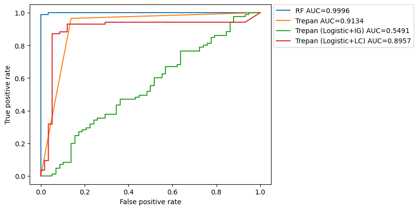
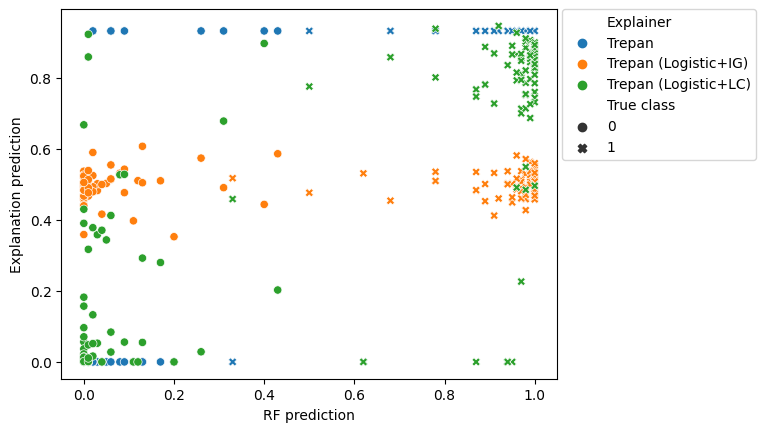

## Model explanation

* Highly accurate supervised learning models are often difficult to interpret
    * Deep networks
    * Random forests
    * Boosted models
    * Nonlinear SVMs

---

* There is a need in various settings to interpret model decisions
    * High-stakes decision making
        * Medical
        * Financial
        * Legal
    * Legal protections
    * User trust

## Post-hoc model-agnostic model translation

* __Post-hoc__: given a learned model $f: \mathcal X \rightarrow \mathcal Y$
* __model-agnostic__: without assumptions about the inner workings of the model
    * Contrast with saliency maps for CNNs
* __model translation__: we learn a model $g$ that performs like $f$ and is interpretable
    * Also called mimic learning

## Interpretable model: decision tree

* Internal nodes describe splits of the data space (define the *scope* of their children)

* Leaf nodes make predictions (often constant estimators, but can be models too)

## Explanation tree learning

* Given a model $f: \mathcal X \rightarrow \mathcal Y$ learn a decision tree with high fidelity to $f$
* Greedy algorithm:
    * _Start w/ a queue of one node (the root)_
    * _While queue is not empty and stopping criteria are not met:_
        * _Pop a node from the queue_
        * ___Generate data__ $(X, f(X))$ in the scope of the node_
        * ___Find a split__ that maximizes a __split score__ on the data_
        * _Generate chilren for the split and push into the queue_

## Question

<table>
<tr><td> Which </td>
<td> split space   split score   data generator   leaf model </td>
<td> makes </td>
<td> high fidelity   iterpretable </td>
<td> trees? </tr>
</table>

## The [`generalizedtrees`](https://github.com/Craven-Biostat-Lab/generalizedtrees) python package

* A joint framework for tree learning that allows swapping in different components that correspond to each design decision.

* ["Recipes"](https://github.com/sverchkov/generalizedtrees/blob/0d5caf8e9a163b7d3c12db3c578d801ceae9e53c/generalizedtrees/recipes.py) for making decision tree learners

## Comparing data generation approaches

* Trepan (Craven and Shavlik 1995)
    * Independent per-feature kernel density or empirical distribution
    * Distributions are re-estimated locally as the tree grows
    * A statistical test is used to determine whether to re-estimate the distribution

* Born-again trees (Breiman and Shang 1996)
    * 'Smearing' - taking a training instance and randomly swapping a random subset of its features with other instances.

### UCI Breast cancer wisconsin dataset

* 569 samples
* 32 real-valued features
* Binary classification (Malignant vs Benign)
* Black box model: Random forest

### ROC curves

!()[../images/breast_cancer_wi_Trepan_vs_BAT_roc.png]

### Agreement plots

!()[../images/breast_cancer_wi_Trepan_vs_BAT_agreement.png]

## Comparing leaf model choice

* Constant estimators at the leaves, vs
* Logistic regression models (regularized with high L1 penalty)

### ROC curves

### Agreement plots

### Tree models:
* [Trepan](../examples/Trepan-ftr-fts-optt-00.html)
* [Born-Again Tree](../examples/BAT-ftr-fts-optt-00.html)
* [Trepan with logistic leaves, information gain score](../examples/TLL-ftr-fts-optt-00.html)
* [Trepan with logistic leaves, linear criterion score](../examples/TLL3-ftr-fts-optt-00.html)

## Near-future work

Further experiments with:
* Additional data generation strategies
* Additional splitting criteria
* Different split spaces
    * splitting on groups of variables based on hierarchies
    * data-driven composite splits (e.g. $m$-of-$n$)
